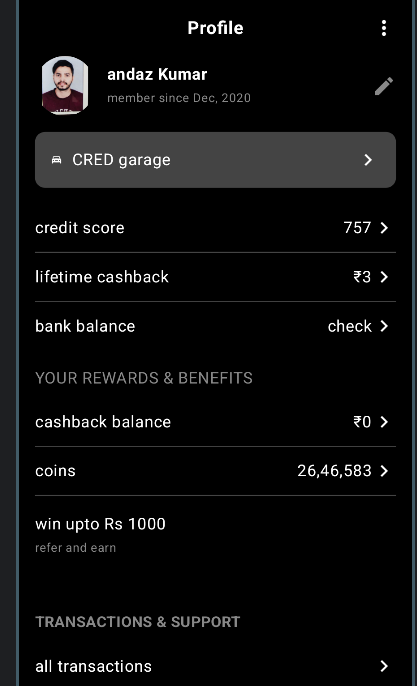

# ProfileActivity - Jetpack Compose Android App

A simple profile screen UI built using **Jetpack Compose**. This app mimics a CRED-like user profile layout and demonstrates usage of composables like `Card`, `Row`, `Column`, `Image`, `Icon`, and custom styling with `Material3`.

---

## 🚀 Features

- Jetpack Compose UI
- Custom Top App Bar
- User Profile Info
- Card with vehicle info ("CRED Garage")
- Credit info section with dividers
- Rewards & Benefits section
- Referral and Transaction UI

---

## 📂 Project Structure

ProfileActivity/
├── app/
│ ├── src/
│ │ ├── main/
│ │ │ ├── java/com/example/profileactivity/MainActivity.kt
│ │ │ ├── res/
│ │ │ │ ├── drawable/
│ │ │ │ │ ├── profile_image.png
│ │ │ │ │ ├── directions_cars.png
│ │ │ │ │ ├── result_output.png ← Screenshot

yaml
Copy
Edit

---

## 📸 Screenshot

| Profile Screen |
|----------------|
|  |

---

## 🛠️ How to Run

1. Open the project in **Android Studio**
2. Make sure you're using **Kotlin** and **Jetpack Compose**
3. Place your assets (images like `profile_image.png`, `directions_cars.png`) in the `res/drawable/` folder
4. Build and run the app on an emulator or device

---

## 🧑‍💻 Author

**Kartik Sharma**  
Android Developer | Kotlin & Jetpack Compose Enthusiast

---

## 📃 License

This project is licensed under the MIT License. Feel free to use, modify, and share
